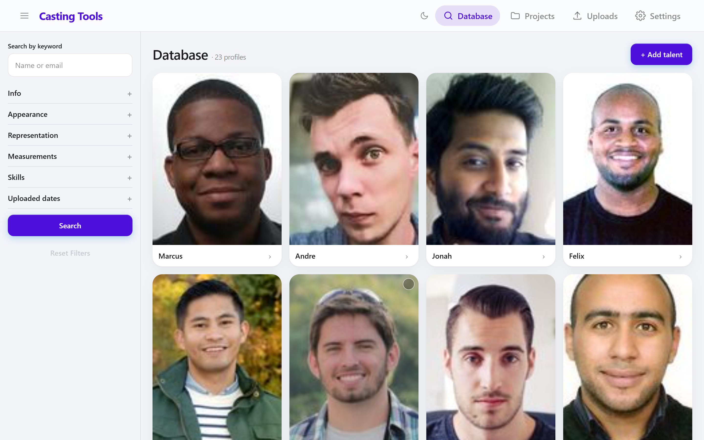

<div align="center">

# Casting Tools — Community Edition

**The self-hosted casting database.** Run your whole agency on a small box: a
private talent database with fast search, casting projects, shareable proposals,
registration forms, bulk email/SMS, availability checks and self-tape collection.

[](https://demo.castingtools.ca)
[](https://castingtools.ca)
[](https://castingtools.ca/docs/self-hosting/)
[](https://github.com/orgs/SafeGuard-Hosting/packages/container/package/safeguard-casting-tools)

[**Live demo**](https://demo.castingtools.ca) · [**Website**](https://castingtools.ca) · [**Self-hosting guide**](https://castingtools.ca/docs/self-hosting/)



</div>

---

This repository is the **official distribution** for self-hosting Casting Tools.
It contains everything you need to run it — a `docker-compose.yml` and an env
template — and points at the official prebuilt image. **Free to self-host.**

> Casting Tools is maintained by **SafeGuard Hosting**. The application source is
> not part of this repo; this is the download + install front door. Prefer not to
> run it yourself? [Managed hosting](https://castingtools.ca) is one click.

## Quick start

You need Docker with the Compose plugin. Then:

```bash
# 1. Grab the compose file + env template
curl -O https://raw.githubusercontent.com/SafeGuard-Hosting/SafeGuard-Casting-Tools-CE/main/docker-compose.yml
curl -o .env https://raw.githubusercontent.com/SafeGuard-Hosting/SafeGuard-Casting-Tools-CE/main/.env.example

# 2. Fill in the secrets (see comments in .env)
#    - CT_SUPER_PASSWORD   openssl rand -hex 24
#    - CT_SESSION_SECRET   openssl rand -hex 32
#    - CT_INITIAL_OWNER_*  your first login

# 3. Bring it up
docker compose up -d
```

The app comes up on `:8080`. Put your own reverse proxy (Caddy, nginx, Traefik,
Cloudflare Tunnel…) in front for TLS, or point a tunnel at it. First boot creates
your workspace and owner account from `CT_INITIAL_OWNER_*`.

## System requirements

Two containers (the app + PostgreSQL) plus a media volume.

|            | CPU    | RAM     | Disk    |
|------------|--------|---------|---------|
| Minimum    | 1 vCPU | 512 MB  | 10 GB   |
| Recommended| 2 vCPU | 1–2 GB  | 20 GB+  |

Search is benchmarked at **30–40 ms across 100,000+ profiles**, so it isn't
CPU-bound. Talent photos live on the media volume (~100–300 KB each); video is
external links, so it doesn't use your disk.

## Updating

```bash
docker compose pull && docker compose up -d
```

Migrations apply automatically on boot; your data volume is preserved. Pin a
version (e.g. `:v1.3.0`) in `docker-compose.yml` instead of `:latest` for
reproducible deploys — see [Releases](../../releases).

## Backups

The app has a built-in **Settings → System → Backup** (pg_dump/restore). For an
off-box copy, configure object storage (S3/MinIO) in `.env`.

## License

Free to self-host for your own agency. Closed source; redistribution of the image
is not permitted. See the demo and website for managed hosting and commercial
terms.
